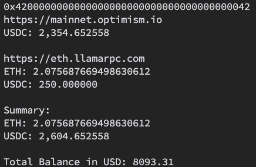

# Crypto Portfolio Tracking

Don't trust sharing your crypto wallet addresses with any websites (like me)?

This simple CLI tool lets you monitor your portfolio locally 👌

## Usage

1. Rename `src/constant_example.rs` to `src/constant.rs`

2. Fill in your `COINGECKO_API`, addresses and rpcs in `constant.rs`. Currently, only Ethereum and Optimism are supported, but more networks can be added by how `ETH_RPC` & `OP_RPC` are inserted in `main.rs`

3. `cargo run` 🥳

## Feature

- Total # of tokens owned by all addresses
- Total USD value of your portfolio

## Snippet

## Built with

- Rust
- ethers-rs
- CoinGecko API
- ❤️
